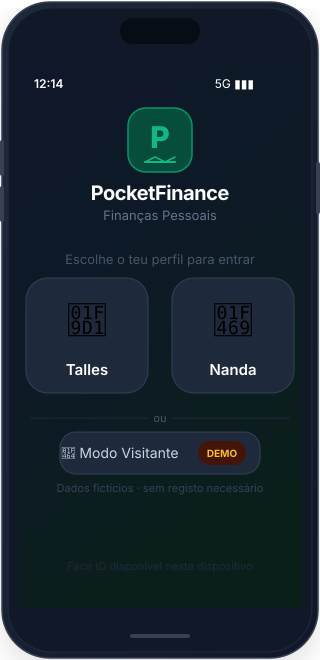
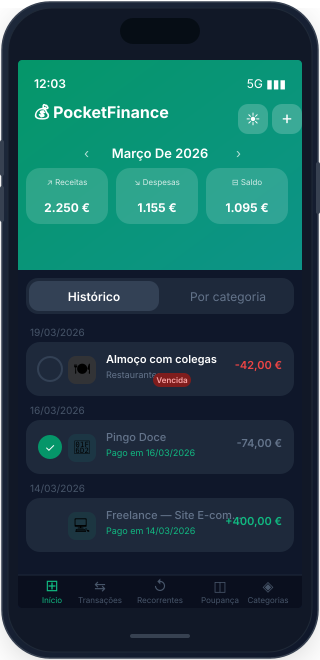
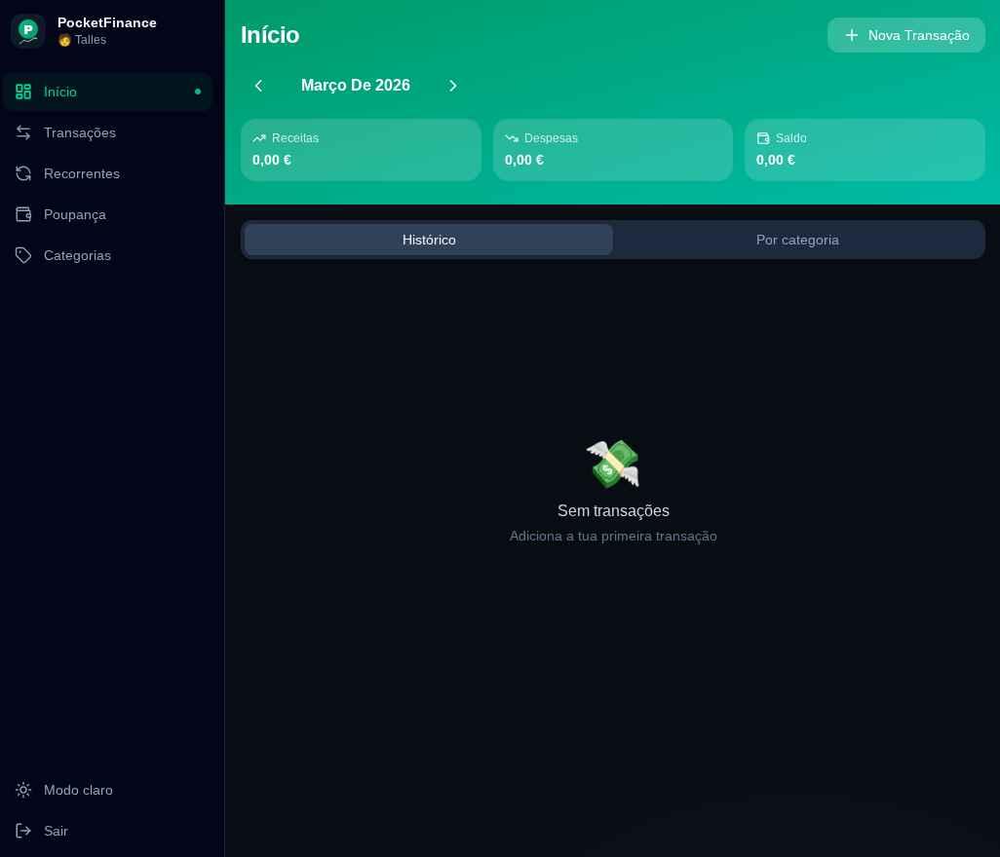

<div align="center">
  
  <h1>PocketFinance</h1>
  <p>Gestão de finanças pessoais e familiares — PWA para telemóvel e web</p>

  <p>
    
    
    
    
    
  </p>
</div>

---

## Preview

<div align="center">
  <table>
    <tr>
      <td align="center">
        
        <br/><sub><b>Login — seleção de perfil</b></sub>
      </td>
      <td align="center">
        
        <br/><sub><b>Início — transações do mês</b></sub>
      </td>
    </tr>
  </table>
</div>

<br/>

<div align="center">
  
  <br/><sub><b>Vista web — desktop</b></sub>
</div>

---

## Funcionalidades

- **Multi-perfil** — acesso individual por PIN (com Face ID opcional no telemóvel)
- **Modo Visitante** — demo com dados fictícios, sem registo necessário
- **Registo de transações** — receitas, despesas, prestações e transações pagas
- **Transações recorrentes** — geração automática mensal
- **Orçamentos por categoria** — com barra de progresso e alertas
- **Resumo por categoria** — acordeão com detalhes de cada despesa
- **Poupanças** — controlo de montantes em múltiplas moedas, com edição e retiradas
- **Transferir para Poupança** — move valor do saldo do mês diretamente para a poupança
- **Saldo acumulado** — o saldo restante de cada mês transita automaticamente para o seguinte
- **Gestão de categorias** — ícones emoji e cores personalizadas
- **Navegação mensal** — histórico mês a mês
- **PWA instalável** — funciona como app nativa no iPhone e Android
- **Modo claro/escuro**

---

## Tech Stack

| Camada | Tecnologia |
|--------|-----------|
| Framework | Next.js 16 (App Router) |
| Linguagem | TypeScript |
| Estilos | Tailwind CSS |
| Base de dados | Supabase (PostgreSQL) |
| Autenticação | PIN personalizado + WebAuthn (Face ID) |
| PWA | manifest.json + Service Worker |

---

## Como executar

### 1. Criar projeto Supabase

Cria um projeto em [supabase.com](https://supabase.com) e executa o SQL em `supabase/schema.sql` no SQL Editor.

### 2. Variáveis de ambiente

Cria o ficheiro `.env.local`:

```bash
NEXT_PUBLIC_SUPABASE_URL=https://your-project.supabase.co
NEXT_PUBLIC_SUPABASE_ANON_KEY=your-anon-key
```

### 3. Instalar e executar

```bash
npm install
npm run dev
```

Abre [http://localhost:3000](http://localhost:3000).

---

## Deploy

Deploy no [Vercel](https://vercel.com) — liga o repositório e adiciona as duas variáveis de ambiente acima.

---

## Relacionado

- **Versão Android:** [FinancasDeBolso](https://github.com/TallesGuerra/FinancasDeBolso) — Kotlin + Jetpack Compose
